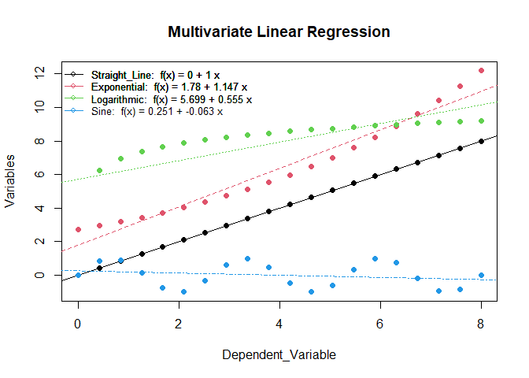

# LearnSL

The goal of LearnSL is to provide a set of functions to perform
supervised classification along with comprehensive explanations of the
algorithms, their pros and cons, and their applications.

## Installation

You can install the released version of LearnSL from
[CRAN](https://cran.r-project.org/) with:

``` r
install.packages("LearnSL")
```

You can install the development version of LearnSL from
[GitHub](https://github.com/) with:

``` r
# install.packages("devtools")
devtools::install_github("ComiSeng/LearnSL")
```

## Example

This is a basic example which shows you how to classify a dataset:

``` r
library(LearnSL)
multivariate_linear_regression(db1rl)
```

<!-- -->

This is yet another example of an implemented classification algorithm,
showing the step by step process:

``` r
library(LearnSL)
perceptron(db_per_and, c(0,0,1), "swish", 1000, 0.1, TRUE, FALSE)
```

    ## 

    ## EXPLANATION

    ## ________________________________________________________________________________
    ## ________________________________________________________________________________

    ## 

    ## Step 1:

    ##     - Generate a random weight for each variable.

    ## Step 2:

    ##     - Check if the weight classify correctly. If they do, go to step 4

    ## Step 3:

    ##     - Adjust weights based on the error between the expected output and the real

    ##      output.

    ##     - If max_iter is reached go to step 4. If not, go to step 2.

    ## Step 4:

    ##     - Return the weigths and use them to classigy the new value

    ## ________________________________________________________________________________
    ## ________________________________________________________________________________

    ## 

    ## Step 1:

    ## Random weights between -1 and 1 are generated for each variable:

    ## [1] -0.1925078  0.5834969 -0.5149636

    ## ________________________________________________________________________________

    ## 

    ## Steps 2 and 3:

    ## Weights do not classify correctly so they get adjusted:

    ##         x1        x2         x3
    ## 6 -0.16915 0.5834969 -0.4916059

    ## Weights do not classify correctly so they get adjusted:

    ##         x1        x2         x3
    ## 6 -0.16915 0.5460439 -0.4916059

    ## Weights do not classify correctly so they get adjusted:

    ##         x1        x2         x3
    ## 6 -0.16915 0.5432479 -0.4944019

    ## Weights do not classify correctly so they get adjusted:

    ##           x1        x2         x3
    ## 6 -0.1913134 0.5210846 -0.4944019

    ## Weights do not classify correctly so they get adjusted:

    ##           x1        x2         x3
    ## 6 -0.2104963 0.5019017 -0.4944019

    ## Weights do not classify correctly so they get adjusted:

    ##           x1        x2         x3
    ## 6 -0.2104963 0.4706379 -0.4944019

    ## Weights do not classify correctly so they get adjusted:

    ##           x1        x2         x3
    ## 6 -0.2251858 0.4559484 -0.4944019

    ## Weights do not classify correctly so they get adjusted:

    ##           x1        x2         x3
    ## 6 -0.2251858 0.4578342 -0.4925162

    ## Weights do not classify correctly so they get adjusted:

    ##           x1        x2         x3
    ## 6 -0.2016524 0.4578342 -0.4689828

    ## Weights do not classify correctly so they get adjusted:

    ##           x1        x2         x3
    ## 6 -0.2016524 0.4297918 -0.4689828

    ## Weights do not classify correctly so they get adjusted:

    ##           x1        x2         x3
    ## 6 -0.2143549 0.4170893 -0.4689828

    ## Weights do not classify correctly so they get adjusted:

    ##           x1        x2         x3
    ## 6 -0.2143549 0.4170893 -0.4689828

    ## Weights do not classify correctly so they get adjusted:

    ##           x1        x2         x3
    ## 6 -0.1914278 0.4170893 -0.4460557

    ## Weights do not classify correctly so they get adjusted:

    ##           x1        x2         x3
    ## 6 -0.2039786 0.4045385 -0.4460557

    ## Weights do not classify correctly so they get adjusted:

    ##           x1        x2         x3
    ## 6 -0.2150088 0.3935082 -0.4460557

    ## Weights do not classify correctly so they get adjusted:

    ##           x1        x2         x3
    ## 6 -0.2150088 0.3960666 -0.4434973

    ## Weights do not classify correctly so they get adjusted:

    ##          x1        x2         x3
    ## 6 -0.224879 0.3861964 -0.4434973

    ## Weights do not classify correctly so they get adjusted:

    ##          x1        x2         x3
    ## 6 -0.214894 0.3861964 -0.4434973

    ## Weights do not classify correctly so they get adjusted:

    ##          x1        x2         x3
    ## 6 -0.214894 0.3861964 -0.4434973

    ## Weights do not classify correctly so they get adjusted:

    ##          x1        x2         x3
    ## 6 -0.224191 0.3768995 -0.4434973

    ## Weights do not classify correctly so they get adjusted:

    ##          x1        x2         x3
    ## 6 -0.224191 0.3768995 -0.4434973

    ## Weights do not classify correctly so they get adjusted:

    ##           x1        x2         x3
    ## 6 -0.2142327 0.3768995 -0.4434973

    ## Weights do not classify correctly so they get adjusted:

    ##           x1        x2         x3
    ## 6 -0.2142327 0.3545446 -0.4434973

    ## Weights do not classify correctly so they get adjusted:

    ##           x1        x2         x3
    ## 6 -0.2217397 0.3470376 -0.4434973

    ## Weights do not classify correctly so they get adjusted:

    ##           x1        x2         x3
    ## 6 -0.2118769 0.3470376 -0.4434973

    ## Weights do not classify correctly so they get adjusted:

    ##            x1        x2         x3
    ## 6 -0.09881823 0.4600963 -0.3304386

    ## Weights do not classify correctly so they get adjusted:

    ##            x1        x2         x3
    ## 6 -0.09881823 0.4600963 -0.3304386

    ## Weights do not classify correctly so they get adjusted:

    ##           x1        x2         x3
    ## 6 -0.1201101 0.4388044 -0.3304386

    ## Weights do not classify correctly so they get adjusted:

    ##           x1        x2         x3
    ## 6 -0.1385627 0.4203518 -0.3304386

    ## Weights do not classify correctly so they get adjusted:

    ##           x1        x2        x3
    ## 6 -0.1205131 0.4203518 -0.312389

    ## Weights do not classify correctly so they get adjusted:

    ##            x1        x2         x3
    ## 6 -0.01988952 0.5209754 -0.2117654

    ## Weights do not classify correctly so they get adjusted:

    ##            x1        x2         x3
    ## 6 -0.01988952 0.5209754 -0.2022941

    ## Weights do not classify correctly so they get adjusted:

    ##            x1        x2         x3
    ## 6 -0.01988952 0.5025237 -0.2207458

    ## Weights do not classify correctly so they get adjusted:

    ##            x1        x2         x3
    ## 6 -0.01988952 0.4864628 -0.2368066

    ## Weights do not classify correctly so they get adjusted:

    ##            x1        x2         x3
    ## 6 -0.01988952 0.4563375 -0.2368066

    ## Weights do not classify correctly so they get adjusted:

    ##            x1        x2         x3
    ## 6 -0.01988952 0.4563375 -0.2263617

    ## Weights do not classify correctly so they get adjusted:

    ##            x1        x2         x3
    ## 6 -0.01988952 0.4435223 -0.2391769

    ## Weights do not classify correctly so they get adjusted:

    ##             x1        x2         x3
    ## 6 -0.008604761 0.4435223 -0.2278922

    ## Weights do not classify correctly so they get adjusted:

    ##             x1        x2         x3
    ## 6 -0.008604761 0.4435223 -0.2278922

    ## Weights do not classify correctly so they get adjusted:

    ##             x1        x2         x3
    ## 6 -0.008604761 0.4315829 -0.2398316

    ## Weights do not classify correctly so they get adjusted:

    ##             x1        x2         x3
    ## 6 -0.008604761 0.4315829 -0.2292712

    ## Weights do not classify correctly so they get adjusted:

    ##             x1        x2        x3
    ## 6 -0.008604761 0.4315829 -0.219116

    ## Weights do not classify correctly so they get adjusted:

    ##           x1        x2         x3
    ## 6 0.08016672 0.5203543 -0.1303445

    ## Weights do not classify correctly so they get adjusted:

    ##           x1        x2         x3
    ## 6 0.07599781 0.5203543 -0.1303445

    ## Weights do not classify correctly so they get adjusted:

    ##          x1       x2          x3
    ## 6 0.1473645 0.591721 -0.05897782

    ## Weights do not classify correctly so they get adjusted:

    ##          x1     x2          x3
    ## 6 0.0973435 0.5417 -0.05897782

    ## Weights do not classify correctly so they get adjusted:

    ##          x1       x2          x3
    ## 6 0.1601565 0.604513 0.003835183

    ## Weights do not classify correctly so they get adjusted:

    ##          x1       x2           x3
    ## 6 0.1512861 0.604513 -0.005035231

    ## Weights do not classify correctly so they get adjusted:

    ##          x1       x2          x3
    ## 6 0.1434398 0.604513 -0.01288156

    ## Weights do not classify correctly so they get adjusted:

    ##          x1       x2          x3
    ## 6 0.1434398 0.604513 -0.01288156

    ## Weights do not classify correctly so they get adjusted:

    ##          x1        x2          x3
    ## 6 0.1434398 0.5654199 -0.01288156

    ## Weights do not classify correctly so they get adjusted:

    ##          x1        x2          x3
    ## 6 0.1357543 0.5654199 -0.01288156

    ## Weights do not classify correctly so they get adjusted:

    ##           x1      x2          x3
    ## 6 0.08888443 0.51855 -0.01288156

    ## Weights do not classify correctly so they get adjusted:

    ##          x1        x2         x3
    ## 6 0.1505709 0.5802365 0.04880491

    ## 

    ## ________________________________________________________________________________

    ## 

    ## Step 4:

    ## Predicted value: 0

    ## Final weigths:

    ##          x1        x2         x3
    ## 6 0.1505709 0.5802365 0.04880491
